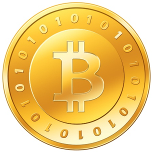

The following is the term paper I submitted for the Technical Writing class at UW in 2015. I'm trying to fill up some contents on my website and I can't come up with anything useful at the moment, so I'm throwing out my past writings here until I figure out which direction I choose to go for the contents.

---

Bitcoin is the digital currency that users can trade online. Although Bitcoin was designed with great care, there are still several risks that make users vulnerable and susceptible to the dangers of Bitcoin. The mainstream public need to know that Bitcoin is unsafe and therefore should not be used as a currency.

## Introduction

Bitcoin was first introduced in 2009 as digital currency by a programmer who uses the internet pseudonym Satoshi Nakamoto, and this unknown person released the software that generates the first Bitcoin. The Bitcoin system uses an open source and peer-to-peer (P2P) network for transactions. Technically speaking, Bitcoin is not a real coin; it is an encrypted digital code, and each code is unique and no other same code exists in the world. Bitcoin is generated using a process called “mining”: A computer is given a complicated mathematical problem to solve and if a computer succeeds, then you are rewarded with a new Bitcoin. The easier way to acquire Bitcoin is to buy it on a Bitcoin Exchange website. Even though Bitcoin was designed with a great deal of consideration and care in mind, it still is not safe to be used as a medium for exchange. Bitcoin should not be used as a currency by the mainstream public, because it is too volatile, vulnerable, and risky.

## Bitcoin is highly volatile.

For the currency to be trusted by the public, it needs to show a sign of stability and continuity. If the value of currency keeps changing drastically, it’s likely to create too much doubt in the Bitcoin market and the public will eventually lose interest in Bitcoin.

- The value of Bitcoin fluctuates wildly. It is traded like a commodity or stock, and the price keeps going up and down rapidly on a daily basis. For example, the price of Bitcoin dropped by 80% in a single day in 2014 (Barker). On February 10, 2014, the price of Bitcoin reached over $600 before falling to $102 the next day. The volatile nature of Bitcoin creates uncertainty for users, and it’s extremely difficult to measure the long-term value of the currency.

- The total circulation of Bitcoin is not big enough and this can lead to unstable market conditions. In other words, relatively small transactions can significantly impact the price of Bitcoin. The unstable nature of the Bitcoin market is an easy target for attackers who want to manipulate its value by buying or selling a large amount of Bitcoin. According to the venture capitalist Fred Wilson, “Bitcoin hoarding and price volatility go hand in hand”, meaning both are interrelated and affect each other.

- Bitcoin does not have a central bank. A central bank such as the Federal Reserve regulates the state of currency, money supply, and interest rate. Since Bitcoin doesn’t have a central bank, maintaining a stable value of the currency is impossible. Without a central bank system to monitor the flow of Bitcoin, there is no way to foresee how much Bitcoin is out in the market.

## Bitcoin is systematically vulnerable.

Bitcoin was created based upon the principle that the entire source code of Bitcoin is open to the public. No organization or entity can control Bitcoin, and it remains a public domain. Since no one is overseeing the Bitcoin market, inevitably there is a lack of protection and this leads to vulnerability issues.

- Bitcoin is not protected by law. Bitcoin is currently not regulated by the government and this makes users legally vulnerable for any transactional dispute. In addition, since Bitcoin cannot be validated by any legal authority, there is no guarantee that people will recognize this as a legitimate currency. If no one accepts Bitcoin, the Bitcoin’s worth suddenly becomes zero and all of its value goes away. Admittedly, the chance of that happening may be small, but the very notion of the possibility can make users unsettling.

- Bitcoin is susceptible to any system failings. If the Bitcoin system crashes and stops working all of a sudden, no one is going to come forward to take the blame, much less try to fix the problem at hand. That’s because the Bitcoin system is based on the open source model, and the biggest drawback of open source model is that there is not enough support or maintenance efforts from programmers. They are all volunteers and not paid for the work they do, and obviously it’s not easy to get motivated when you work for free.

- Users are vulnerable to fraud or scam. The overall process of transaction between two parties is somewhat complex and it can be challenging to someone who is not well versed in technology. Users are expected to be familiar with the operational concepts such as mining, block chain, private keys, ledger, etc. If users are not completely aware of how the Bitcoin works, they can be susceptible to fraudsters or scam artists.

Bitcoin is technologically risky.
If Bitcoin might disappear into thin air one day, users need to ask themselves if that’s the risk worth taking. Bitcoin is vulnerable to cyber-attacks from outside and technical failure from inside. If Bitcoin is somehow lost or stolen, there is no way to trace it due to the anonymous nature.

- Bitcoin is not safe from the threat of hackers. Hacking is not just limited to individual users but also the big Bitcoin Exchange as well. A major incident of hacking took place in February 2014 when Mt. Gox, the biggest Bitcoin Exchange in Japan, was shut down after millions of dollars’ worth of Bitcoin was stolen (Bajpai).

- System glitches or malfunctioning can lead to financial losses. If something goes wrong during the transaction and the error occurs, users are solely responsible for any financial losses. In a hypothetical sense, the system can collapse at any moment and users can lose all their Bitcoin at once. It is too risky to depend on the belief that the system will be secure somehow.

- It is not possible to recover Bitcoin once it is lost. What happens if a credit card is stolen and used by a thief? Would customers be liable for any stolen amount? The answer is no, because credit card issuers have the fraud protection policy. Even the stolen cash might have a slight possibility to be recovered no matter how low the chance may be. However, if someone successfully hacks into users’ Bitcoin, it is gone forever. There is no mechanism to recover lost Bitcoin.

Conclusion
Bitcoin has lost its credibility as a reliable currency and it is time Bitcoin was rejected by the mainstream public. Unless appropriate action is taken to raise the awareness of the Bitcoin’s risks, it will continue to produce the unfortunate victims of this unsafe currency. Let’s not tolerate it any longer and start warning the public against Bitcoin.
